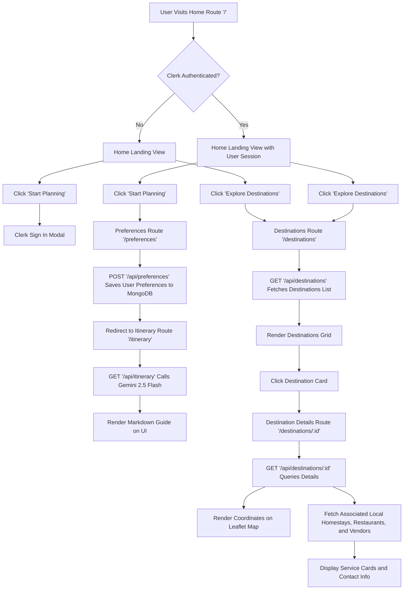

# Tour Mate (Smart Travel Planner)

Tour Mate is a Next.js-based web application that facilitates travel planning by generating custom, budget-conscious itineraries. By using generative AI alongside a database of verified local service providers, the application helps users plan their trips while promoting local accommodations, eateries, and travel services.

## Application Workflow

The diagram below outlines the core user flows, including authentication, preference-based itinerary generation via AI, and direct destination searches.



## Key Features

### Custom Itinerary Generation
The application integrates the Google Gemini 2.5 Flash model to compile day-by-day travel schedules based on user-defined trip settings. These itineraries are generated dynamically and rendered directly as structured markdown guides.

### Destination Discovery
Users can explore individual destination routes showing local, verified offerings:
- Leaflet-based interactive maps pinpointing destination coordinates.
- Curated listings of local homestays (with descriptions and pricing) dynamically linked to destinations.
- Regional restaurants categorized by cuisine.
- Local vendors and service providers (guides, transport providers) to support community tourism.

### Identity and Preference Profiles
- Secured routes and user authentication handled through Clerk.
- Persistent user preference storage using MongoDB to save target destination details, budget caps, and duration configurations.

## Technology Stack

- **Framework**: Next.js 15 (App Router)
- **Language**: TypeScript
- **Styling**: Tailwind CSS, PostCSS
- **Database**: MongoDB with Mongoose ODM
- **Authentication**: Clerk
- **AI Integrations**: Google Generative AI SDK (Gemini 2.5 Flash)
- **Maps**: Leaflet and React Leaflet
- **Icons**: Lucide React

## Project Directory Structure

```text
├── app/
│   ├── (auth)/                  # Clerk authentication sign-in and sign-up pages
│   ├── api/
│   │   ├── destinations/        # Fetch destination list and detailed query routes
│   │   ├── itinerary/           # Generates day-by-day itineraries based on preferences
│   │   └── preferences/         # CRUD actions for user travel settings
│   ├── destinations/            # Destination collection and details pages
│   ├── itinerary/               # Page containing the final AI-generated itinerary
│   └── preferences/             # Preferences input form
├── components/
│   ├── Map.tsx                  # Integrates React Leaflet maps
│   └── Navbar.tsx               # Main header navigation bar
├── lib/
│   ├── auth.ts                  # Helper module validating Clerk session states
│   └── mongodb.ts               # Database connector
├── models/                      # MongoDB Schemas
│   ├── Destination.ts
│   ├── Homestay.ts
│   ├── Restaurant.ts
│   ├── User.ts
│   └── Vendor.ts
├── scripts/
│   └── seed.ts                  # Database reset and mock data seeding script
└── types/
    └── travel.ts                # Typings for itineraries and profiles
```

## Database Schema Definitions

1. **User (User.ts)**
   Tracks user identity synced from Clerk, as well as the active travel preference parameters (destination, travelType, budget, duration).

2. **Destination (Destination.ts)**
   Contains basic geographic meta details (name, description, thumbnail) alongside geographical latitude and longitude keys to feed the map rendering layer.

3. **Homestay (Homestay.ts)**, **Restaurant (Restaurant.ts)**, **Vendor (Vendor.ts)**
   Models for local services linked back to a specific `destinationId`. They structure items like pricing ranges, cuisine types, contact numbers, and service descriptions.

## Local Configuration and Run Guide

### Environment Variables
Configure a `.env.local` file in your root folder using the keys listed below:

```env
MONGODB_URI = "mongodb://localhost:27017/smart_tourism"

NEXT_PUBLIC_CLERK_PUBLISHABLE_KEY=your_clerk_publishable_key
CLERK_SECRET_KEY=your_clerk_secret_key

NEXT_PUBLIC_CLERK_SIGN_IN_URL=/sign-in
NEXT_PUBLIC_CLERK_SIGN_UP_URL=/sign-up
NEXT_PUBLIC_CLERK_AFTER_SIGN_IN_URL=/destinations
NEXT_PUBLIC_CLERK_AFTER_SIGN_UP_URL=/destinations

GOOGLE_API_KEY=your_google_gemini_api_key
```

### Installation Steps

1. Install project dependencies:
   ```bash
   npm install
   ```

2. Seed database records with mock destinations and business listings:
   ```bash
   npm run seed
   ```

3. Launch the development server:
   ```bash
   npm run dev
   ```
   The local build runs on http://localhost:3000.

## Maintenance and Build Commands

- `npm run dev`: Fires up the local development listener.
- `npm run build`: Generates the optimized production build of the NextJS application.
- `npm run start`: Runs the output from the build folder in a production-ready environment.
- `npm run lint`: Performs quality checks on code files to identify TypeScript or NextJS standard violations.
